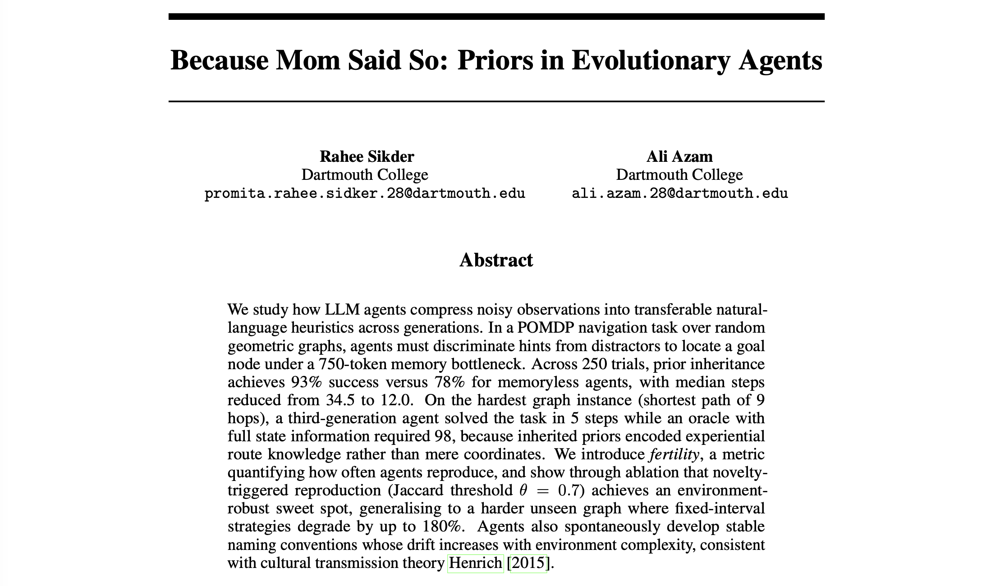

# Because Mom Said So: Priors in Evolutionary Agents
**COSC 89.34/189 Final Project** by {promita.rahee.sikder,ali.azam}.28@dartmouth.edu



## About

This project investigates how inherited priors affect the performance of LLM-powered agents in a partially observable environment. Agents navigate a graph-based POMDP (a Random Geometric Graph) where they must identify a goal door among several candidates by interpreting structured signals (spatial, color, relational, narrative, and pattern-based). Agents reproduce over generations, optionally passing compressed knowledge (priors) to their children, mimicking cultural transmission. The question is whether these inherited beliefs help descendant agents solve the task faster and more reliably than starting from scratch. The experiment suite includes ablations on prior inheritance, parent–child interaction, lexical shortcuts, skill libraries, cloaked goals, and fertility strategies, with Bayesian belief tracking available as an optional reasoning layer.

## Usage
Make sure to set up your Dartmouth Chat API key and LangChain (via developer.dartmouth.edu) in the .env file. There is an example .env file present for refernece.

Then run
```bash
uv sync
uv run_experiments --exp all --trials 50 # Viability study
uv run_experiments --exp a --trials 250  # Main experiment on testing priors
```

There are some other code artifacts from failed experiments and future work, such as RGGs using cloaking as in graph theory research. Results should be generated in the `results/` directory.
